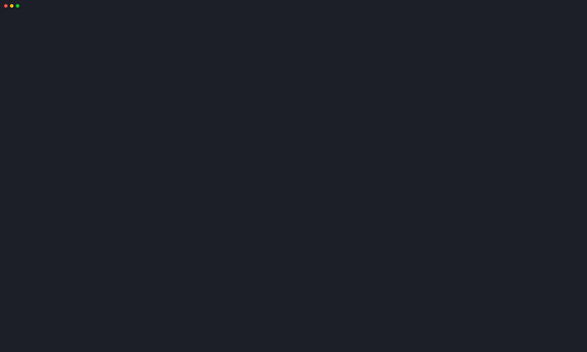
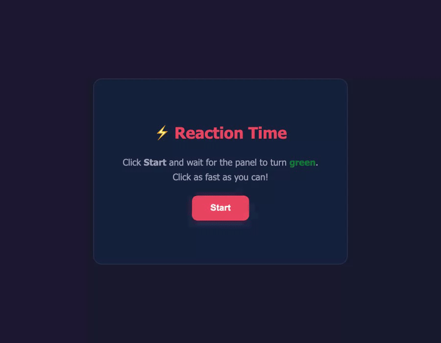

# MA Showcase

Real, reproducible demos showing [MA](https://github.com/zimoos/my-agent) turn a prompt into a verified result. MA is a coding agent that works in a repository, runs what it produced, and keeps the evidence.



Each demo keeps four things together:

1. The prompt and task boundary.
2. The exact command used to run MA.
3. The generated artifact and a direct verification step.
4. A terminal recording made from that same command.

This repository does not use synthetic agent output or staged completion claims. A demo is only listed after its artifact exists and the recorded command has completed.

## Demos

| Demo | What it proves | Artifact |
| --- | --- | --- |
| [01 Terminal Status](demos/01-terminal-status/) | MA creates and verifies a standalone UI artifact through its filesystem tool. | `artifact/index.html` |
| [02 Reaction Time](demos/02-reaction-time/) | MA builds a browser interaction, then a real browser test reaches its result state. | `artifact/index.html` |
| [03 Versioned MemoryPatch](demos/03-memorypatch-proof/) | MA drives a local synthetic-rule memory through metadata-verified mount, a new version, and rollback. | `EVIDENCE.json` |

### 02 Reaction Time



The artifact, browser recording, and verifier are committed together. The GIF shows a Playwright-run browser opening the generated game, waiting for its live "go" state, clicking the panel, and reaching the result screen.

## Shareable Evidence

[Vertical short video](social/ma-agora-reaction-short.mp4) packages the actual tool-call evidence and browser result into an 11-second 1080x1920 clip. It is ready for YouTube Shorts and Douyin; [posting copy and the reproducible render script](social/) are included.

[Versioned MemoryPatch evidence](demos/03-memorypatch-proof/) adds a bounded local-memory proof: two synthetic rules became two auditable patch versions, then the active profile rolled back to the first version. Its [vertical short](social/ma-memorypatch-proof-short.mp4), images, raw evidence, and rerun script are committed together. It deliberately does not claim unlimited context or general cloud-model parity.

## Run Locally

The recorded runs use MA with an Agora local setup. That runtime detail is only needed when reproducing this exact environment; the user-facing proof remains the same: MA created a real artifact and the browser verified it.

```bash
AGORA_ROOT=/path/to/agora bash demos/01-terminal-status/run.sh

# For the browser interaction demo
AGORA_ROOT=/path/to/agora bash demos/02-reaction-time/run.sh
npm ci
npx playwright install chromium
npm run verify:reaction

# Verify the recorded MemoryPatch evidence and render its social assets
npm run verify:memorypatch
npm run render:memorypatch
```

The replay scripts exit successfully only after the generated file is present and non-empty. The reaction-time verifier also proves that the artifact reaches a result screen after a real click sequence.

## Status

This is an early showcase repository. Every recording is a real local run; model speed and output can vary by hardware and model version. The initial reaction-time run took roughly two minutes before its file-tool action; it is evidence of a working artifact, not a claim that every local machine will finish at that speed.
